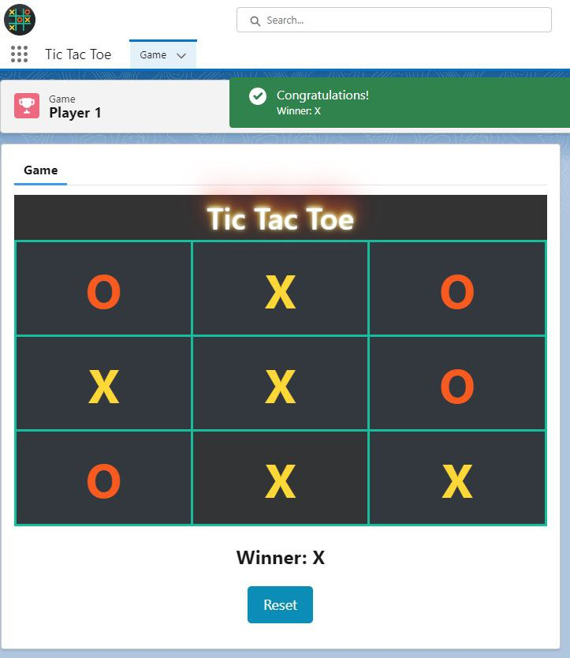

**The Tic Tac Toe game** is an interactive Lightning Web Component (LWC) that allows users to play the classic game of Tic Tac Toe. The LWC component consists of a code implementation that manages the game logic, user interactions, and visual representation of the game board.

Upon starting the game, players can choose their side, either 'X' or 'O.' The component keeps track of the current player and displays a message indicating whose turn it is. Players can click on the cells of the game board to place their respective marks. The component validates the moves and checks for a winner or a tie game.

The game utilizes a grid-based structure, represented by a table in the LWC's template. Each cell in the grid is associated with a data-index value, allowing the component to identify the selected cell during a click event. As the game progresses, the component updates the board state, displays the player's mark in the clicked cell, and checks for a winning combination or a tie game.

If a player wins, a toast message is displayed congratulating the winner. In the case of a tie game, another toast message is shown to acknowledge the result. The component provides a reset button to start a new game, clearing the board and resetting the necessary variables.

Overall, the Tic Tac Toe LWC component offers an engaging and interactive user experience while demonstrating the use of LWC and the Lightning framework in building a functional game application.

# lwc-tic-tac-toe
